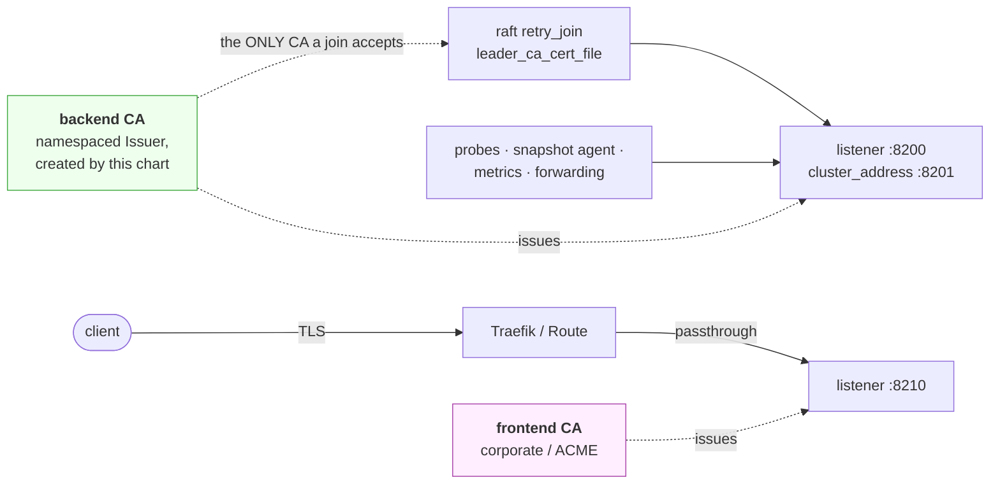

# openbao-platform

A Helm umbrella chart around the [official OpenBao chart](https://github.com/openbao/openbao-helm).

- **Split TLS trust.**
  A backend CA for raft and in-cluster traffic, a separate CA for the ingress, on two listeners.
  [Detail](docs/ARCHITECTURE.md#the-two-trust-domains)
- **Certificates from cert-manager or from your own Secrets.**
  Per trust domain.
  [Detail](docs/ARCHITECTURE.md#where-the-frontend-certificate-comes-from)
- **In-place certificate reload.**
  A renewal is picked up without restarting, so a Shamir cluster stays unsealed.
  [Detail](docs/BACKLOG.md#3-switch-tlsreloadmethod-to-auto-once-available)
- **Bootstrap Job.**
  Initialises, unseals, configures auth, policies and roles, then revokes the root token.
  [Detail](docs/ARCHITECTURE.md#bootstrap-sequence)
- **JWT/OIDC auth.**
  For the backup service account and for GitLab CI.
  [Detail](docs/AUTH.md)
- **Raft snapshots to S3.**
  A CronJob, plus an opt-in restore Job.
  [Detail](docs/RESTORE.md)
- **Audit isolation.**
  Declarative audit devices and an OpenTelemetry Collector that buffers to disk and exports OTLP, with no audit records on stdout.
  [Detail](docs/AUDIT.md)
- **Auto-unseal.**
  Azure Key Vault or Transit.
  [Detail](docs/SEAL.md)
- **Airgap.**
  Vendored subchart, four mirrorable images.
  [Detail](docs/AIRGAP.md)

## Requirements

1. Kubernetes 1.30+ and Helm 3.
2. A StorageClass for the raft and audit volumes.
3. cert-manager, unless both `tls.internal.source` and `tls.server.source` are set to `secret`.
4. A namespace carrying Pod Security `restricted` labels.
   Set `namespace.create: true` and let the chart make it, or create it yourself.
   Helm's `--create-namespace` produces one with no labels.
5. Any credential Secrets in that namespace: S3 for snapshots, GitLab CA, seal credentials.
   Secrets are namespaced, so these need copying in.
6. The release name must be `openbao`.
   Subchart resource names derive from it and the Secret names in `values.yaml` are literals matching it.
   The render fails on any other name.

## Install

Copy `examples/values-prod.yaml` and replace every `CHANGEME-` value.
There are 16, and [docs/VALUES.md](docs/VALUES.md) says what each one does and how it fails when wrong.

```sh
helm upgrade --install openbao openbao/ -n openbao \
  -f my-values.yaml

kubectl -n openbao logs -f job/openbao-bootstrap-1 -c bootstrap   # Watch the bootstrap
kubectl -n openbao get secret openbao-init-keys -o yaml           # Store the keys offline
kubectl -n openbao delete secret openbao-init-keys                # Then destroy them
```

Overlays in `openbao/examples/` layer on top, `values-openshift.yaml` last, since it turns the Ingress off and the Route on.
`values-azure.yaml` fetches the seal plugin tarball with an initContainer; `values-azure-oci.yaml` has OpenBao pull the image instead, with a `registry-login` initContainer writing the registry credential from the pod's own ServiceAccount.

```sh
  -f openbao/examples/values-prod.yaml \
  -f openbao/examples/values-azure.yaml \
  -f openbao/examples/values-openshift.yaml
```

`global.openshift` is the only platform switch.
`false`, the default, pins the uid and `fsGroup` that vanilla Kubernetes does not assign.
`true` leaves them to the SCC.
It is a Helm global, so setting it once at the top of your own umbrella reaches every layer, including the vendored subchart.

Unseal keys and the root token reach the Job log only when `deployment.environment` is `development`, the server log level is `debug` or `trace`, and `bootstrap.keyOutput.revealWhenDebug` is on.
`examples/values-dev.yaml` sets all three.

## The TLS split

Two listeners with two CAs.
Port 8200 carries raft join, forwarding, probes and in-cluster clients.
Port 8210 carries ingress traffic.



`retry_join.leader_ca_cert_file` names the backend CA alone, so a certificate from the frontend CA does not join the cluster.

The frontend listener is off by default.
Turning it on takes `tls.server.enabled`, an `https-frontend` entry in `openbao.server.extraPorts`, and whatever the certificate source requires.
The render fails naming what is missing.

Each domain draws its certificate from [`tls.<domain>.source`](docs/ARCHITECTURE.md#where-the-frontend-certificate-comes-from): `cert-manager` issues and renews it, `secret` mounts a `kubernetes.io/tls` Secret you create.
A backend Secret also has to carry `ca.crt` and cover every per-pod DNS name, since raft joins validate against it.

OpenShift Routes default to `passthrough`, so OpenBao terminates TLS and the router holds no certificate.
[`route.termination`](docs/ARCHITECTURE.md#route-termination) covers `reencrypt`.

## Testing

```sh
helm test openbao -n openbao --filter name=openbao-test-connection
```

## Inherited defects

Documented here so they can be dropped once fixed upstream.

- **The subchart's helm test pod declares no resources**, so a `ResourceQuota` rejects it, and it mounts no CA, so it fails against any TLS-enabled install.
  Values cannot disable it, hence the `--filter` above.
- **`tls_auto_reload` is absent from OpenBao 2.6.2** and the server only warns about the unknown field, so the setting reads as applied while the certificate goes stale.
  `tlsReload.method` stays on `sighup` until a release carries it.
  [Detail](docs/BACKLOG.md#3-switch-tlsreloadmethod-to-auto-once-available)

## Future

- Alerting rules
- Shamir to auto-unseal migration path
- Bootstrap Job reaping
- Bootstrap pre-flight records excluded from the audit stream
- Restore Job scratch volume sizing

## Docs

| | |
|---|---|
| [ARCHITECTURE.md](docs/ARCHITECTURE.md) | components, the two trust domains, certificate sources, bootstrap sequence, cross-chart value coupling |
| [VALUES.md](docs/VALUES.md) | every `CHANGEME-` placeholder and how it fails when wrong |
| [AUDIT.md](docs/AUDIT.md) | audit isolation, declarative devices, and the four failure modes |
| [AUTH.md](docs/AUTH.md) | JWT/OIDC for the backup service account and GitLab CI |
| [RESTORE.md](docs/RESTORE.md) | why backups need the unseal keys, and what is automated |
| [SEAL.md](docs/SEAL.md) | auto-unseal: the v2.7.0 plugin migration, Workload Identity, Artifactory |
| [AIRGAP.md](docs/AIRGAP.md) | the images, mirroring, and what egress remains |
| [BACKLOG.md](docs/BACKLOG.md) | reviewed-but-not-actioned findings |
