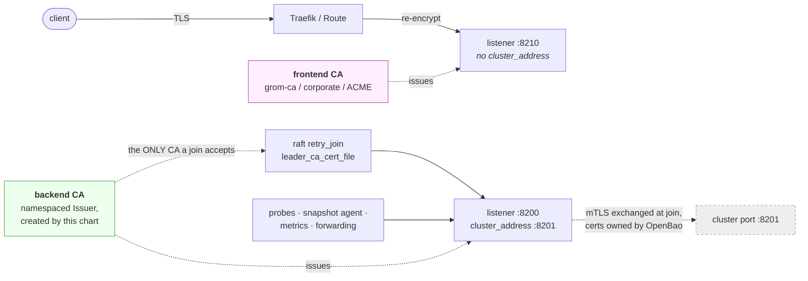
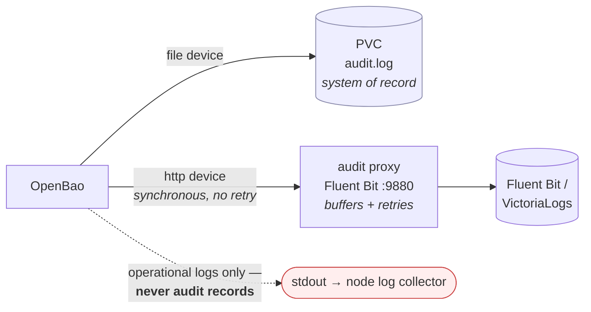

# openbao-platform

A Helm umbrella chart around the [official OpenBao chart](https://github.com/openbao/openbao-helm),
adding the things a production install needs and the upstream chart deliberately
leaves to you:

| | |
|---|---|
| **Split TLS trust** | cert-manager PKI with a backend CA (raft, in-cluster) kept separate from a frontend CA (ingress), on two different listeners |
| **Bootstrap** | one-shot Job that initialises, unseals, configures auth and policy, then **revokes the root token** |
| **OIDC auth** | JWT auth for the backup service account and for GitLab CI/CD (OpenTofu) |
| **Backups** | the upstream raft-snapshot CronJob, wired to S3 and authenticated by OIDC |
| **Restore** | an interlocked, opt-in restore Job, plus the runbook for the parts that cannot be automated |
| **Audit isolation** | declarative audit devices and a buffering forward proxy, so audit records never reach stdout |
| **Cert rotation** | certificates reload in place when cert-manager renews them — no restart, so a Shamir cluster does not seal |
| **Auto-unseal** | Azure Key Vault via Workload Identity (external plugin, ready for the v2.7.0 removal) or Transit, per environment |
| **Targets** | OpenShift and airgapped installs; vendored subchart, two mirrorable images |

Built and verified against a real cluster — see [Verified behaviour](#verified-behaviour).

```
charts/openbao-platform/   the chart
  values.yaml              base values, heavily commented
  values-dev.yaml          development overlay (reveals keys, keeps root)
  values-openshift.yaml    SCCs, UBI images, Route
  values-heathernetes.yaml the homelab k3s deployment
  values-azure.yaml        Azure Key Vault auto-unseal (Workload Identity)
  values-transit.yaml      Transit auto-unseal against another OpenBao
  charts/openbao-0.29.2.tgz  vendored subchart (48 KB)
docs/                      architecture, audit, restore, airgap
scripts/prepare-namespace.sh
```

## Quick start

```sh
# 1. Namespace with Pod Security labels + a copy of the S3 credentials.
#    Needs cluster-admin.
KUBECONFIG=~/.kube/config-admin ./scripts/prepare-namespace.sh

# 2. Install. The release name is load-bearing — see below.
KUBECONFIG=~/.kube/config-admin helm upgrade --install openbao \
  charts/openbao-platform -n openbao \
  -f charts/openbao-platform/values-heathernetes.yaml

# 3. Watch the bootstrap.
kubectl -n openbao logs -f job/openbao-bootstrap-1 -c bootstrap

# 4. Take the unseal keys off the cluster, then destroy them.
kubectl -n openbao exec openbao-0 -- cat /openbao/init-keys/README.txt
kubectl -n openbao get secret openbao-init-keys -o yaml   # store offline
kubectl -n openbao delete secret openbao-init-keys
```

> **The release name must be `openbao`.** Every subchart resource name derives
> from the *release* name, and the TLS/init Secret names in `values.yaml` are
> literals matching it (Helm cannot template subchart values). Using a different
> release name fails the render with an explicit message rather than deploying
> something that silently cannot connect.

## The TLS split

The thing this chart exists for. Two listeners, two CAs, one of which raft will
never accept.

The frontend listener is **off by default**, so the chart installs cleanly as a
single-trust-domain deployment. Turning it on is deliberate and takes four
settings together — `tls.server.enabled`, a *different* `tls.server.issuerRef`,
`tls.server.dnsNames`, and an `https-frontend` entry in
`openbao.server.extraPorts` (which is what makes the raft config emit the second
listener). Get one wrong and the render fails naming it; see
`values-heathernetes.yaml` for a worked example.



`retry_join.leader_ca_cert_file` points at the **backend** CA only. A
certificate issued by the frontend CA cannot join the raft cluster, so
compromising your public/corporate CA does not get an attacker into the cluster.
Verified by test: the backend listener accepts the backend CA and rejects the
frontend CA.

**cert-manager cannot own the raft cluster port.** OpenBao generates and rotates
the mTLS certificates for port 8201 itself, exchanging them over the API port at
join time. What cert-manager owns here is the API-port certificate that the join
handshake is validated against — which is the seam that actually matters.

The backend CA is a namespaced `Issuer`, not a `ClusterIssuer`, on purpose: a
ClusterIssuer can be referenced from any namespace, so anyone able to create a
Certificate anywhere in the cluster could mint something a raft join would trust.

Full detail in [docs/ARCHITECTURE.md](docs/ARCHITECTURE.md).

## Bootstrap

A `Job` with `completions: 1, parallelism: 1` — "runs on one node" is structural,
not a convention, and there is no leader election to get wrong. Every step is
guarded, so a re-run reconfigures instead of re-initialising.

1. **Pre-flight the audit endpoint** (see [docs/AUDIT.md](docs/AUDIT.md) — this
   step prevents an unrecoverable cluster)
2. `operator init` → parse keys → **write the Secret before unsealing anything**
3. Unseal every replica
4. Raft autopilot, policies, JWT/OIDC auth mounts, roles
5. Report, then **revoke the root token** and delete it from the Secret

### Where the keys go

Default is a Kubernetes Secret, optionally mounted read-only into the server
pods so they are literally files you can read and then destroy:

```sh
kubectl -n openbao exec openbao-0 -- cat /openbao/init-keys/root-token
kubectl -n openbao delete secret openbao-init-keys   # removes them everywhere
```

Keys are printed to the Job log **only** when all three hold: `deployment.environment=development`,
the server log level is `debug`/`trace`, and `bootstrap.keyOutput.revealWhenDebug`
is on. `values-dev.yaml` sets all three. Job logs are readable by anyone with
`pods/log` and are shipped to your log collector, so this is deliberately hard
to enable by accident.

### Root token revocation

On by default. Once the auth mounts, policies and roles exist, nothing needs
root, and a root token never expires. After revocation the `root-token` entry is
deleted from the Secret and replaced with a `root-token-revoked` marker.

Nothing is lost: a new root token can be regenerated from the unseal keys with
`bao operator generate-root`. **Preserving the unseal keys off-cluster matters
far more than keeping this token** — see [docs/RESTORE.md](docs/RESTORE.md).

## Auth

Both consumers use the **JWT** auth method rather than the Kubernetes auth
method, so there is one auth model instead of two, and no `TokenReview` call on
every login.

- **Backup service account** — JWT auth via OpenBao's built-in `kubernetes`
  provider, which derives the discovery URL from `KUBERNETES_SERVICE_HOST` and
  authenticates with the pod's own service account token and CA. No extra RBAC,
  no anonymous discovery access, no egress off the cluster. The agent uses an
  **audience-bound projected token** (`aud: openbao`), so it cannot be replayed
  against the Kubernetes API.
- **GitLab CI/CD (OpenTofu)** — JWT auth against your GitLab instance, with
  `bound_claims` on `project_path`, `ref`, `ref_protected`. Off by default;
  fill in `bootstrap.gitlab` and see [docs/AUTH.md](docs/AUTH.md).

Both roles set `token_no_default_policy`, so an identity carries only the policy
it was granted.

## Audit

Audit records must never reach stdout: everything on stdout is collected off the
node into a general-purpose log store that a much wider set of people can read.



Devices are declared in the **config file**, not enabled through the API. The
file device is always first and is not optional: OpenBao stops serving requests
when every enabled audit device is failing, and the http device is synchronous
with no retry. The proxy exists precisely because of that — it accepts in
microseconds, then buffers and retries on its own.

[docs/AUDIT.md](docs/AUDIT.md) covers the two non-obvious failure modes that will
otherwise cost you an afternoon.

## Resources and quotas

Every container declares **both requests and limits for both cpu and memory**,
including init containers and the helm test pod, so the chart installs cleanly
into a namespace with a `ResourceQuota`.

One exception is outside this chart's control: the **subchart's own helm test
pod declares no resources** and will be rejected under a quota. Run only this
chart's test:

```sh
helm test openbao -n openbao --filter name=openbao-test-connection
```

The upstream test is also incompatible with TLS — it mounts no CA and has no
`-tls-skip-verify`, so it cannot pass against any TLS-enabled install.

## Verified behaviour

Deployed to a single-node k3s cluster and checked end to end:

- Clean install from zero → bootstrap `Succeeded`, raft leader elected
- Backend listener accepts the backend CA, **rejects** the frontend CA
- External request through Traefik → frontend listener → `HTTP 200`, with real
  CA verification (no `insecureSkipVerify`)
- Snapshot CronJob: OIDC login → raft snapshot → uploaded to Garage S3
- Audit records in VictoriaLogs with tokens HMAC'd; **zero** audit records on
  the container's stdout
- Root token revoked; `root-token` gone from both the Secret and the pod mount
- Re-running the bootstrap after revocation completes cleanly instead of failing
  the upgrade

## Airgap

The subchart is vendored (`charts/openbao-0.29.2.tgz`) with `Chart.lock`
committed, so rendering never reaches a Helm repo. Four images to mirror — see
[docs/AIRGAP.md](docs/AIRGAP.md).

## OpenShift

`values-openshift.yaml` switches to UBI images, clears the explicit
securityContexts so the SCC can assign a uid from the namespace range, and uses
a `Route` with `reencrypt` termination instead of an Ingress.

**Layer it last** — it turns the Ingress off and the Route on, and a later `-f`
would undo that:

```sh
helm upgrade --install openbao charts/openbao-platform -n openbao   -f charts/openbao-platform/values-prod.yaml   -f charts/openbao-platform/values-openshift.yaml   # last
```

## Docs

| | |
|---|---|
| [ARCHITECTURE.md](docs/ARCHITECTURE.md) | components, the two trust domains, bootstrap sequence, cross-chart value coupling |
| [AUDIT.md](docs/AUDIT.md) | audit isolation, declarative devices, and the two failure modes that brick a cluster |
| [AUTH.md](docs/AUTH.md) | JWT/OIDC for the backup service account and GitLab CI |
| [RESTORE.md](docs/RESTORE.md) | why backups need the unseal keys, and what is automated vs runbook |
| [BACKLOG.md](docs/BACKLOG.md) | reviewed-but-not-actioned findings, ordered by what bites first |
| [SEAL.md](docs/SEAL.md) | auto-unseal: the v2.7.0 plugin migration, Workload Identity, and getting the plugin in from Artifactory |
| [AIRGAP.md](docs/AIRGAP.md) | the images, mirroring, and what egress remains |

14 mermaid diagrams across those, all parse-checked.
