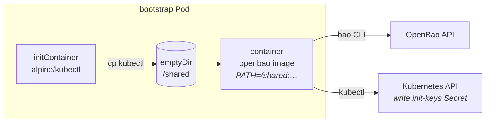

# Airgapped installs

## Chart

The subchart is vendored and `Chart.lock` is committed, so rendering never
contacts a Helm repository:

```
charts/openbao-platform/charts/openbao-0.29.2.tgz    48 KB
charts/openbao-platform/Chart.lock
```

To bump it: edit `Chart.yaml`, run `helm dependency update`, commit the new
`.tgz` and lock file.

## Images

Four, all overridable:

| Image | Used by | Values key |
|---|---|---|
| `quay.io/openbao/openbao:2.6.2` | server **and** bootstrap Job | `openbao.server.image` |
| `docker.io/alpine/kubectl:1.34.1` | bootstrap init container | `bootstrap.kubectlImage` |
| `ghcr.io/openbao/openbao-snapshot-agent:0.4.1` | snapshot CronJob **and** restore Job | `openbao.snapshotAgent.image`, `restore.image` |
| `docker.io/fluent/fluent-bit:4.0.5` | audit proxy | `auditProxy.image` |
| `ghcr.io/openbao/openbao-plugin-kms-azure:v0.1.0` | Azure Key Vault seal (only when `seal.plugin.source: oci`) | `openbao.server.seal.plugin.image` |
| `docker.io/curlimages/curl:8.11.1` | seal plugin fetch initContainer (only when `seal.plugin.source: preloaded`) | in `values-azure.yaml` |

On OpenShift, `values-openshift.yaml` switches the server to
`quay.io/openbao/openbao-ubi`.

### Why kubectl is a second image

The OpenBao image ships busybox `wget`, which supports only GET and POST and
cannot be pointed at the cluster CA — so it cannot write the init-keys Secret.
Rather than run the whole bootstrap from a kubectl image and lose the `bao` CLI
(and with it correct TLS handling and API compatibility), an init container
copies just the kubectl binary into a shared `emptyDir`. Both images are static,
so it is a plain file copy.

`docker.io/rancher/kubectl` will **not** work here — it is distroless and has no
shell to run the copy with.



### Seal plugin

Needed only for the Azure environment; `transit` needs no plugin. Mirror either
the OCI image or the release tarball, depending on `seal.plugin.source`:

```sh
# OCI path — --all keeps the multi-arch index
skopeo copy --all \
  docker://ghcr.io/openbao/openbao-plugin-kms-azure:v0.1.0 \
  docker://$REG/openbao/openbao-plugin-kms-azure:v0.1.0

# preloaded path — a generic Artifactory repo
curl -fLO https://github.com/openbao/openbao-plugins/releases/download/kms-azure-v0.1.0/openbao-plugin-kms-azure_linux_amd64_v1.tar.gz
curl -fLO https://github.com/openbao/openbao-plugins/releases/download/kms-azure-v0.1.0/checksums-kms-azure.txt
```

Either way OpenBao verifies the binary against `seal.plugin.sha256sum` on load,
so a mirror cannot substitute a different binary. See
[SEAL.md](SEAL.md) for the two-different-binary-names trap.

## Mirroring

```sh
REG=registry.internal.example.com
for img in \
  quay.io/openbao/openbao:2.6.2 \
  docker.io/alpine/kubectl:1.34.1 \
  ghcr.io/openbao/openbao-snapshot-agent:0.4.1 \
  docker.io/fluent/fluent-bit:4.0.5
do
  skopeo copy "docker://$img" "docker://$REG/${img#*/}"
done
```

Then override:

```yaml
openbao:
  global:
    imagePullSecrets:
      - name: internal-registry
  server:
    image: { registry: registry.internal.example.com, repository: openbao/openbao }
  snapshotAgent:
    image: { repository: registry.internal.example.com/openbao/openbao-snapshot-agent, tag: "0.4.1" }
bootstrap:
  kubectlImage: { registry: registry.internal.example.com, repository: alpine/kubectl, tag: "1.34.1" }
auditProxy:
  image: { registry: registry.internal.example.com, repository: fluent/fluent-bit, tag: "4.0.5" }
restore:
  image: { registry: registry.internal.example.com, repository: openbao/openbao-snapshot-agent, tag: "0.4.1" }
```

## Network egress

By design, almost nothing leaves the cluster:

| Path | Destination | Notes |
|---|---|---|
| Kubernetes JWT auth | `kubernetes.default.svc` | in-cluster only; the provider derives the URL from env |
| raft join / forwarding | pod DNS | in-cluster |
| snapshot upload | your S3 | in-cluster if S3 is in-cluster |
| audit shipping | your log aggregator | in-cluster |
| **GitLab OIDC** | your GitLab | the only external hop, and only if enabled |

There is no call to any public OIDC discovery endpoint, no ACME by default, and
no image pull at runtime beyond the four above.
