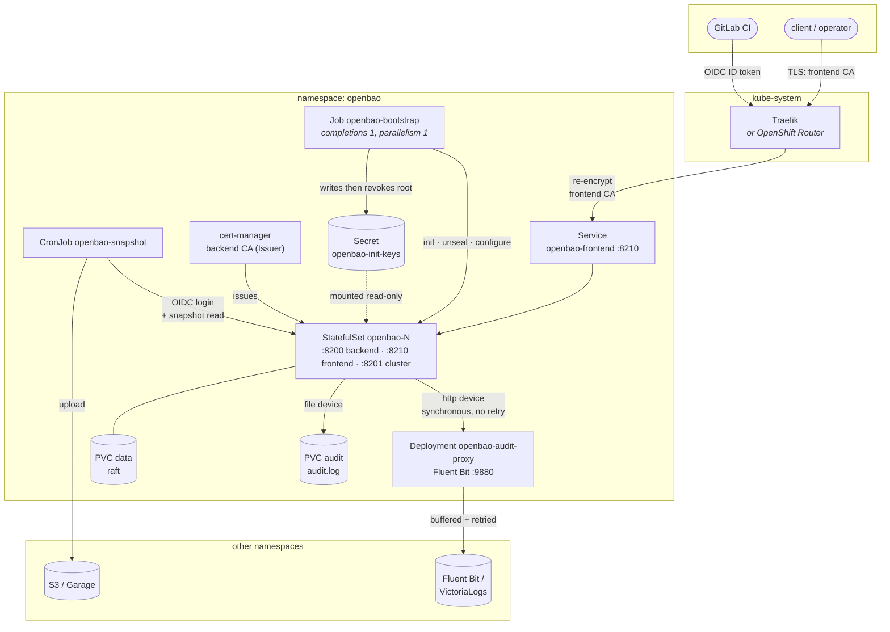
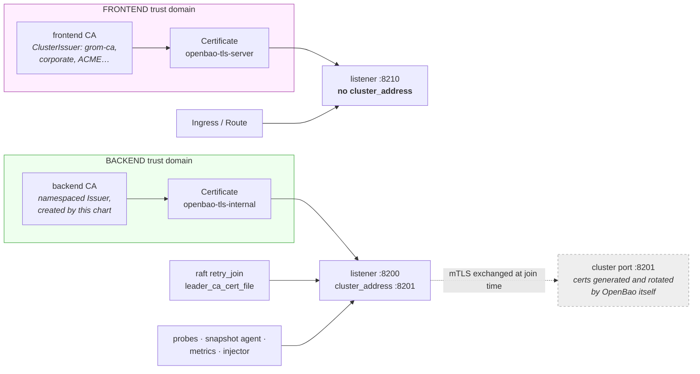
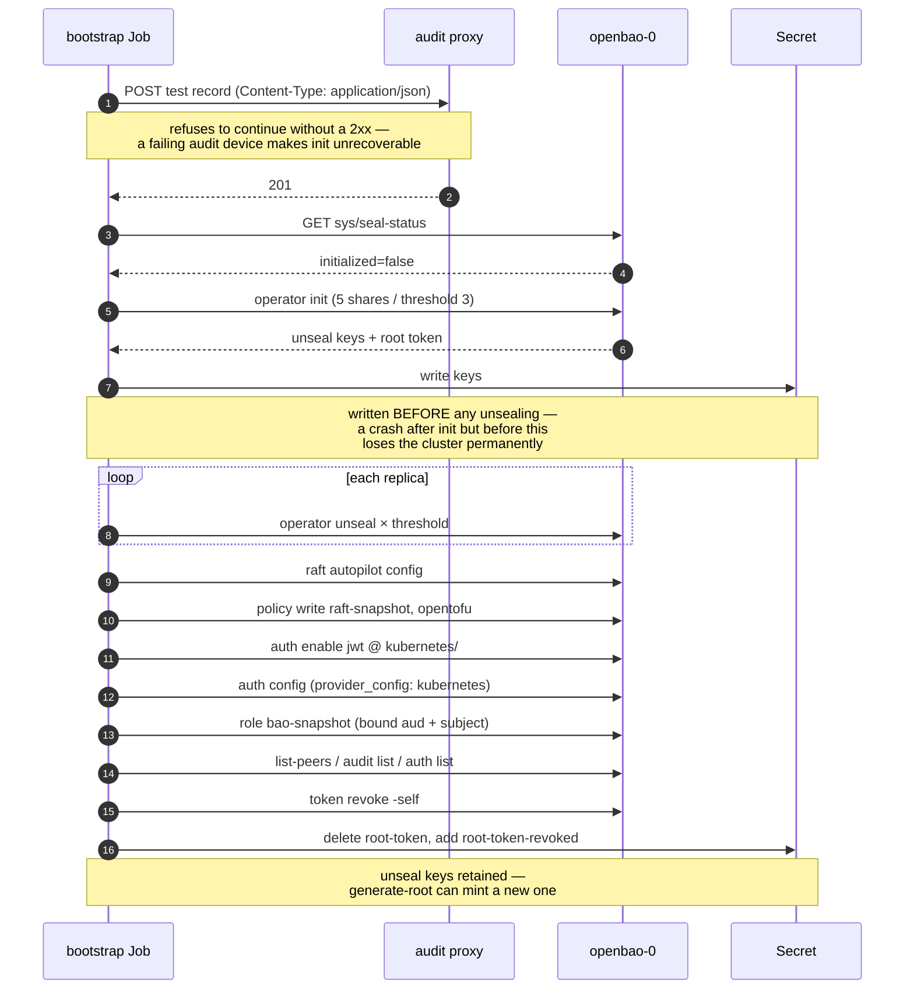
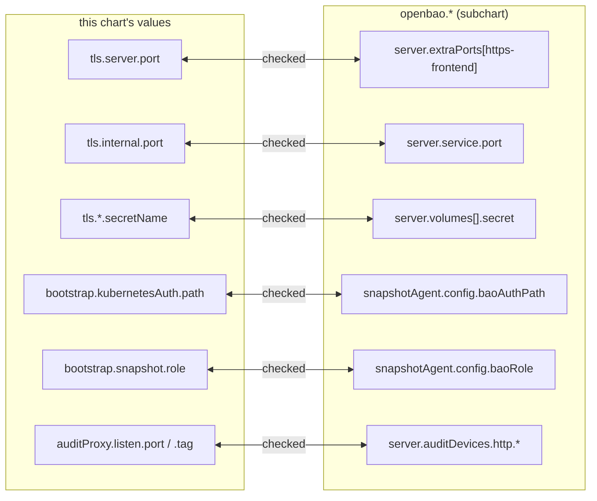

# Architecture

## Components



## The two trust domains

The central design decision. Two listeners on the same pod, each presenting a
certificate from a **different** CA, with only one of them reachable by a raft
peer.



**Why it holds.** `retry_join.leader_ca_cert_file` names the backend CA and
nothing else. A certificate signed by the frontend CA is not valid for any peer
address and would not be accepted on a join, so compromising the public or
corporate CA does not get an attacker into the raft cluster.

Verified directly — the backend listener accepts the backend CA and rejects the
frontend CA:

```
:8200 with backend CA  → HTTP 200
:8200 with frontend CA → SSL certificate problem: unable to get local issuer certificate
```

**cert-manager cannot own port 8201.** OpenBao generates and rotates the cluster
port's mTLS certificates itself and exchanges them over the API port when a node
joins. The seam cert-manager *can* own is the API-port certificate the join
handshake is validated against — which is the one that matters.

**The backend CA is a namespaced `Issuer`, not a `ClusterIssuer`.** A
ClusterIssuer is referenceable from any namespace, so anyone able to create a
Certificate anywhere in the cluster could mint something a raft join would trust.
Namespacing it makes that impossible without RBAC in this namespace.

### Why the ports look backwards

The backend is on 8200 and the frontend on 8210, which is the reverse of the
intuitive layout. The upstream chart hardcodes 8200 in its readiness probe,
Services, Kubernetes service registration and snapshot-agent ConfigMap. Putting
the *in-cluster* trust domain there means all of that keeps working untouched;
the frontend is the one thing only the Ingress needs to reach, so it is the one
that moves.

## Bootstrap sequence



## Where values must agree

Helm does not template subchart values, so several settings are coupled across
the boundary and the coupling is invisible. `templates/_validate.tpl` turns each
one into a render-time failure naming the value to fix, rather than a deployment
that renders perfectly and silently cannot connect.



Other checks: issuer separation (frontend and backend must not share an issuer),
odd raft replica counts, `file` audit device present whenever `http` is, audit
storage enabled when the file device is, and restore requiring a token that will
still exist after root revocation.

## Release naming

Subchart resource names derive from the **release** name. The TLS and init
Secret names in `values.yaml` are literals matching a release called `openbao`,
because subchart values cannot be templated. Renaming the release fails the
render with an explicit message; to actually rename it, change the literals in
`tls.*.secretName`, `bootstrap.keyOutput.secretName` and
`openbao.server.volumes` together.
