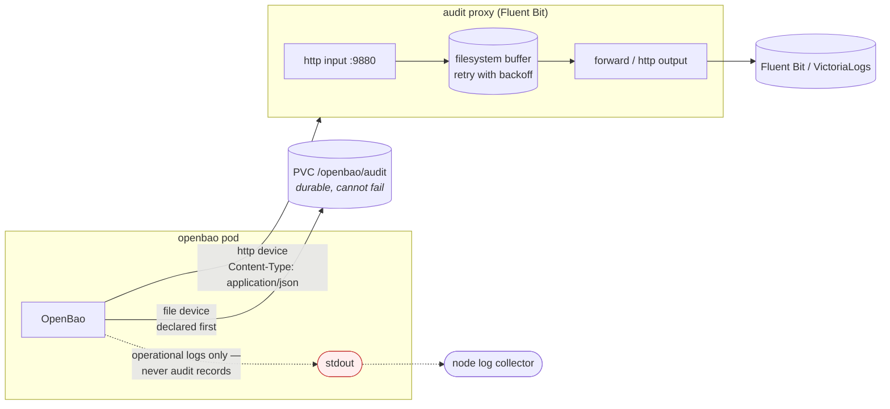
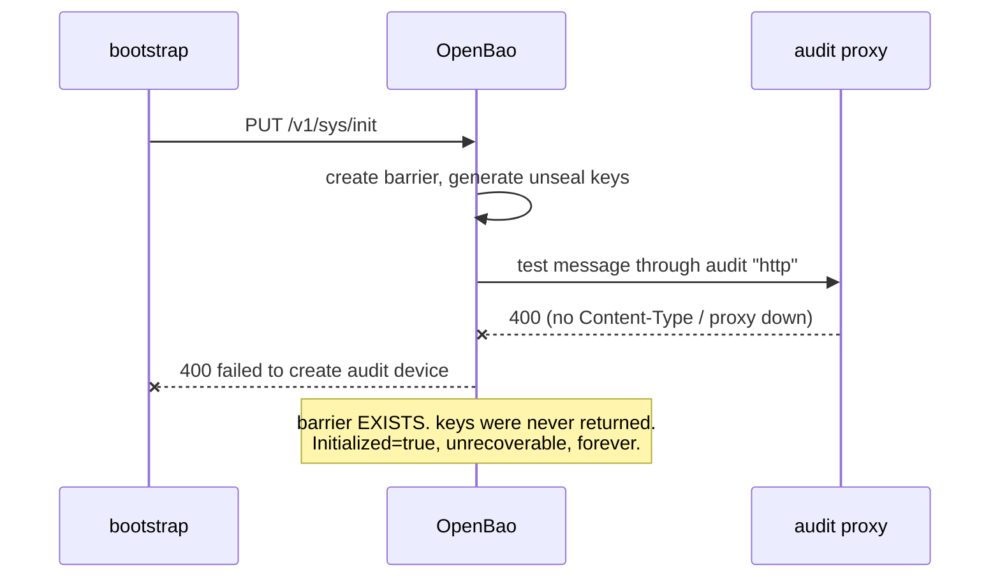

# Audit log isolation

## The goal

Audit records must not reach a container's stdout. Everything on stdout is
collected off the node by the cluster log collector and lands in a
general-purpose log store, which a much wider set of people can read than should
see OpenBao's audit trail.

OpenBao HMAC-SHA256s secret *values* before they ever reach a device, so records
are not plaintext secrets. But request paths, policy names, token accessors,
client IPs and identity metadata are all in the clear — and that metadata is
exactly what you do not want in a shared log store. `log_raw` must stay off;
this chart never sets it.

## The pipeline



The proxy is a Fluent Bit deployment with an `http` input, filesystem buffering
and retry. It exists rather than pointing OpenBao straight at your log
aggregator because **the http audit device is synchronous and does not retry** —
it is on OpenBao's request path. The proxy accepts in microseconds and deals
with the downstream on its own.

There is deliberately **no `stdout` output plugin** in the generated Fluent Bit
config, and this chart will not render one. `auditProxy.logLevel` controls
Fluent Bit's own diagnostics, never record payloads. The pod also carries the
common collector-exclusion annotations as a second line of defence.

## Declarative, not API-managed

Devices are declared in the server config file:

```hcl
audit "file" "file" {
  options { file_path = "/openbao/audit/audit.log", elide_list_responses = "true" }
}
audit "http" "http" {
  options {
    uri     = "http://openbao-audit-proxy.openbao.svc:9880/openbao.audit"
    headers = "{\"Content-Type\":[\"application/json\"]}"
  }
}
```

Consequences:

- applied on startup and SIGHUP, not on demand;
- a config-declared device **cannot be modified through the API** and cannot
  duplicate an API-created device;
- deleting a stanza deletes the device;
- **stanza order is the order they are applied**, and `file` is first on purpose.

`elide_list_responses` is on: list responses can name thousands of secrets, so
eliding them cuts both volume and a real information-leak surface.

## Two failure modes that will cost you an afternoon

### 1. A failed audit device makes the cluster unrecoverable

Config-declared audit devices are created during `operator init`. OpenBao writes
a **test message** through each one. If that fails, the init API call returns
400 — but the barrier has *already* been created. The result is a cluster that
reports `Initialized: true` whose unseal keys were **never returned to anyone**.
It can never be unsealed. The only fix is to destroy the storage and start again.

This is not hypothetical; it happened twice while building this chart.



The bootstrap Job therefore **pre-flights the audit endpoint before init**,
POSTing a test record with the same method, path and Content-Type OpenBao will
use, and refuses to initialise if it does not get a 2xx.

The dependency is narrower than it looks, and it was measured rather than
assumed. With the proxy scaled to zero, OpenBao starts, unseals, loads BOTH
audit devices and serves requests normally — because *loading* an existing
device does not write a test message. Only *creating* one does. So the proxy is
a dependency of `operator init` and of adding a new audit stanza, not of
everyday startup or rescheduling, and the pre-flight above already covers it.

While the proxy is down, `http` records are simply not shipped; the `file`
device keeps them, so the gap is in the downstream stream, not in the audit
trail itself. Shipping resumes on its own when the proxy returns.

### 2. The Content-Type trap

OpenBao's http audit device does:

```go
req.Header = b.headers.Clone()      // internal/builtin/audit/http/backend.go
```

It **replaces** the request headers with whatever `headers` is configured to,
rather than adding to them. With no `headers` option, the POST goes out with no
`Content-Type` at all.

Fluent Bit's http input is strict about it:

| Content-Type | Result |
|---|---|
| `application/json` | **201** |
| `application/json; charset=utf-8` | 400 `invalid 'Content-Type'` |
| `text/plain` | 400 `invalid 'Content-Type'` |
| *(absent)* | 400 `header 'Content-Type' is not set` |

So `auditDevices.http.headers` defaults to `Content-Type: ["application/json"]`
and must not be removed. Combined with failure mode 1, dropping it does not
produce a shipping problem — it produces an unrecoverable cluster.

### 3. Default-deny in the downstream namespace

If your log aggregator's namespace has a default-deny ingress policy, shipping
fails with:

```
[output:http] no upstream connections available to <host>:<port>
```

Nothing is lost — records buffer and retry — but nothing arrives, and the only
clue is in the proxy's own log. Set:

```yaml
auditProxy:
  output:
    downstreamNetworkPolicy:
      enabled: true
      namespace: monitoring
```

which creates a NetworkPolicy **in that namespace** admitting just the audit
proxy on just the sink port. Off by default, because writing into someone else's
namespace should be a deliberate choice.

## Running the proxy as a sidecar instead

For the strictest isolation, run the proxy on `127.0.0.1` inside the OpenBao pod
so audit records never touch the pod network at all:

```yaml
auditProxy:
  enabled: false          # no separate Deployment
openbao:
  server:
    auditDevices:
      http:
        enabled: true
        host: 127.0.0.1
    extraContainers:
      - name: audit-proxy
        image: docker.io/fluent/fluent-bit:4.0.5
        args: ["--config=/fluent-bit/etc/fluent-bit.conf"]
        resources:
          requests: {cpu: 50m, memory: 64Mi}
          limits:   {cpu: 500m, memory: 256Mi}
        volumeMounts:
          - {name: audit-proxy-config, mountPath: /fluent-bit/etc/fluent-bit.conf, subPath: fluent-bit.conf}
```

Trade-off: one proxy per replica, no aggregation, and you supply the ConfigMap.
It also removes the startup dependency described above only partially — the
sidecar still has to be listening before OpenBao initialises.

## Verifying

```sh
# records arriving downstream
kubectl -n monitoring port-forward svc/<vlsingle> 9428:9428
curl -sG localhost:9428/select/logsql/query \
  --data-urlencode 'query=log_source:"openbao-audit" | stats count() total'

# and NOT on stdout
kubectl -n openbao logs openbao-0 -c openbao | grep -c '"type":"response"'   # expect 0
```
