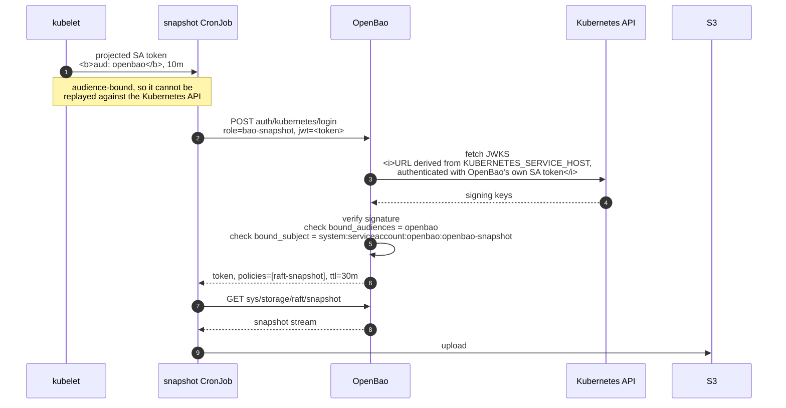
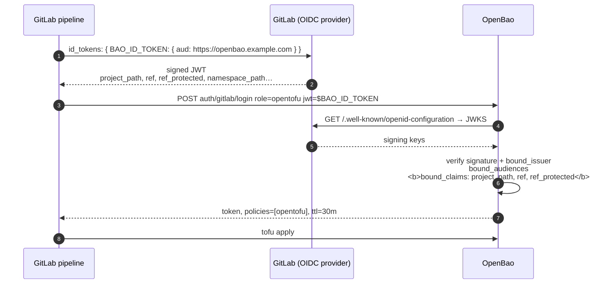

# Authentication

Both consumers use the **JWT** auth method rather than the Kubernetes auth
method. One auth model instead of two, no `TokenReview` call on every login, and
no `system:auth-delegator` binding.

The trade-off worth stating: JWT auth validates signatures, so a token revoked
in Kubernetes stays valid to OpenBao until it expires. Keep TTLs short — this
chart uses 30m with a 10m projected token.

## Backup service account



Configured by the bootstrap as:

```json
{ "provider_config": { "provider": "kubernetes" } }
```

**`provider_config` is a discovery method in its own right and must be used
alone.** OpenBao enforces "exactly one of `jwt_validation_pubkeys`, `jwks_url`,
`jwks_pairs`, `oidc_discovery_url` or `provider_config`", and the Kubernetes
provider additionally rejects `oidc_discovery_url` outright. Sending both — which
some documentation shows — fails with:

```
exactly one of 'jwt_validation_pubkeys', 'jwks_url', 'jwks_pairs',
'oidc_discovery_url', or 'provider_config' must be set
```

The provider deliberately does not accept a URL: it builds one from
`KUBERNETES_SERVICE_HOST`/`PORT` and authenticates with the pod's own service
account token and CA. That is what makes it need no extra RBAC, no anonymous
access to the discovery document, and **no egress off the cluster** — which is
what makes it work in an airgap.

The policy is the whole authority the agent has:

```hcl
path "sys/storage/raft/snapshot" { capabilities = ["read"] }
```

with `token_no_default_policy`, so the identity does not also carry `default`.
Confirmed in the audit trail:

```
auth.display_name = kubernetes-system:serviceaccount:openbao:openbao-snapshot
auth.policies     = ["raft-snapshot"]
request.path      = sys/storage/raft/snapshot
```

### Alternative: explicit JWKS

`bootstrap.kubernetesAuth.discovery: jwks` points at
`/openid/v1/jwks` with the cluster CA instead. Use it only if the built-in
provider fails, and note it usually requires binding
`system:service-account-issuer-discovery` to `system:unauthenticated`.

## GitLab CI/CD → OpenTofu



Enable with:

```yaml
bootstrap:
  gitlab:
    enabled: true
    url: https://gitlab.example.com
    audience: https://openbao.example.com
    policies:
      opentofu: |
        path "sys/mounts"         { capabilities = ["read", "list"] }
        path "sys/mounts/*"       { capabilities = ["create","read","update","delete","list"] }
        path "sys/policies/acl/*" { capabilities = ["create","read","update","delete","list"] }
        path "auth/*"             { capabilities = ["create","read","update","delete","list"] }
        path "kv/*"               { capabilities = ["create","read","update","delete","list"] }
    roles:
      - name: opentofu
        policies: [opentofu]
        tokenTtl: 30m
        userClaim: project_path
        boundClaims:
          project_path: platform/openbao-config
          ref: main
          ref_type: branch
          ref_protected: "true"
```

Pipeline side:

```yaml
configure:
  id_tokens:
    BAO_ID_TOKEN:
      aud: https://openbao.example.com     # must equal bootstrap.gitlab.audience
  script:
    - export BAO_ADDR=https://openbao.example.com
    - export BAO_TOKEN="$(bao write -field=token auth/gitlab/login
        role=opentofu jwt=$BAO_ID_TOKEN)"
    - tofu apply
```

### bound_claims are the security boundary

Without them, **any** pipeline on the GitLab instance can assume the role — the
JWT is perfectly valid, it just came from someone else's project. Always bind at
least `project_path`. For a role that can write, bind `ref` and
`ref_protected: "true"` as well, so an unprivileged branch cannot mint a token
that reconfigures OpenBao.

`ref_protected` arrives as the **string** `"true"`, not a boolean.

Airgap note: this is the only auth mount that talks to anything outside the
cluster, and it only ever reaches your own GitLab. For a private CA, set
`bootstrap.gitlab.caPem`.
