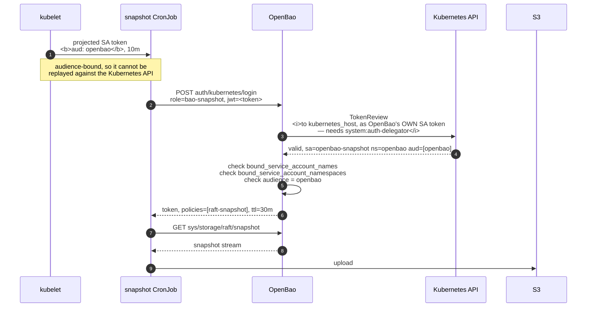
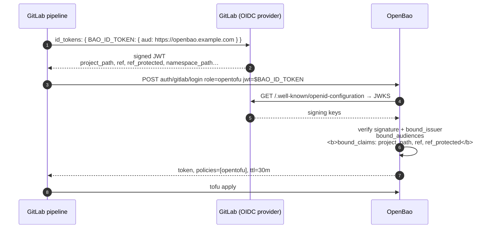

# Authentication

Two auth mounts, deliberately different methods. Kubernetes service accounts
use the **Kubernetes** auth method; GitLab CI uses the **JWT** method, because
there is no TokenReview API on the other side of the internet.

The Kubernetes method does not check a signature. It hands the token to the API
server (`POST /apis/authentication.k8s.io/v1/tokenreviews`) and believes the
answer. That costs a live call to the API server on every login and a
`system:auth-delegator` ClusterRoleBinding, and it buys **immediate
revocation**: delete the ServiceAccount and the next login fails. JWT auth,
which this mount used previously, verified the signature locally and needed
neither — at the price that a token revoked in Kubernetes stayed good to
OpenBao until it expired. TTLs stay short regardless: 30m tokens from a 10m
projected token.

## Backup service account


```mermaid
sequenceDiagram
    autonumber
    participant K as kubelet
    participant C as snapshot CronJob
    participant B as OpenBao
    participant A as Kubernetes API
    participant S as S3

    K->>C: projected SA token<br/><b>aud: openbao</b>, 10m
    Note over K,C: audience-bound, so it cannot be<br/>replayed against the Kubernetes API

    C->>B: POST auth/kubernetes/login<br/>role=bao-snapshot, jwt=<token>
    B->>A: TokenReview<br/><i>to kubernetes_host, as OpenBao's OWN SA token<br/>— needs system:auth-delegator</i>
    A-->>B: valid, sa=openbao-snapshot ns=openbao aud=[openbao]
    B->>B: check bound_service_account_names<br/>check bound_service_account_namespaces<br/>check audience = openbao
    B-->>C: token, policies=[raft-snapshot], ttl=30m

    C->>B: GET sys/storage/raft/snapshot
    B-->>C: snapshot stream
    C->>S: upload
```

Configured by the bootstrap as:

```sh
bao write auth/kubernetes/config kubernetes_host=https://kubernetes.default.svc

bao write auth/kubernetes/role/bao-snapshot \
  bound_service_account_names=openbao-snapshot \
  bound_service_account_namespaces=openbao \
  audience=openbao \
  alias_name_source=serviceaccount_uid \
  token_policies=raft-snapshot token_ttl=30m token_max_ttl=1h \
  token_type=service token_no_default_policy=true
```

`kubernetes_host` is the only required config field — OpenBao rejects the write
with `no host provided` otherwise. `kubernetes_ca_cert` and `token_reviewer_jwt`
are deliberately left unset: unset, OpenBao reads the pod's own
`/var/run/secrets/kubernetes.io/serviceaccount/{ca.crt,token}`, so there is no
Secret to manage, no egress, and it works in an airgap. Set either only when
reviewing against an API server that is not the one that issued the pod's token.

**`bound_service_account_names` and `bound_service_account_namespaces` are the
authorisation boundary.** Both are required by OpenBao, and neither may mix `*`
with a real value, so a role cannot accidentally end up accepting every account
in the cluster. `audience` is the third check: the projected token must carry
`openbao`, so a token minted for the Kubernetes API cannot be replayed here.

`alias_name_source` defaults to `serviceaccount_uid`, which means the identity
does not transfer if the ServiceAccount is deleted and recreated under the same
name. Set `serviceaccount_name` to get `openbao/openbao-snapshot` in the audit
trail instead of a uuid, accepting that.

### The RBAC this costs

```yaml
kind: ClusterRoleBinding
roleRef: { kind: ClusterRole, name: system:auth-delegator }
subjects: [{ kind: ServiceAccount, name: openbao, namespace: openbao }]
```

Without it every login fails with a 403 from the API server, which surfaces to
the client as a permission error from OpenBao and reads like a policy problem.

The binding is required; **the chart creating it is not.** It is cluster-scoped
— the most privileged object here, and the identity installing this chart very
often cannot write one, especially when the chart is a dependency of a larger
umbrella deployed by a namespace-scoped account. So
`bootstrap.kubernetesAuth.rbac.create: false` is a supported configuration, not
an error: it renders no binding, does not fail, and the install notes print the
manifest above for a cluster admin to apply separately. Logins 403 until they
do, and the bootstrap has to run again afterwards to finish configuring the
mount.

The third option is `tokenReviewerJwt`: a token for some other identity that
already holds `system:auth-delegator`. Then the OpenBao ServiceAccount needs
nothing, at the cost of a long-lived credential in a Secret.

The policy is the whole authority the agent has:

```hcl
path "sys/storage/raft/snapshot" { capabilities = ["read"] }
```

with `token_no_default_policy`, so the identity does not also carry `default`.
Confirmed in the audit trail:

```
auth.display_name = kubernetes-openbao-snapshot
auth.policies     = ["raft-snapshot"]
request.path      = sys/storage/raft/snapshot
```

## GitLab CI/CD → OpenTofu


```mermaid
sequenceDiagram
    autonumber
    participant P as GitLab pipeline
    participant G as GitLab (OIDC provider)
    participant B as OpenBao

    P->>G: id_tokens: { BAO_ID_TOKEN: { aud: https://openbao.example.com } }
    G-->>P: signed JWT<br/>project_path, ref, ref_protected, namespace_path…

    P->>B: POST auth/gitlab/login role=opentofu jwt=$BAO_ID_TOKEN
    B->>G: GET /.well-known/openid-configuration → JWKS
    G-->>B: signing keys
    B->>B: verify signature + bound_issuer<br/>bound_audiences<br/><b>bound_claims: project_path, ref, ref_protected</b>
    B-->>P: token, policies=[opentofu], ttl=30m
    P->>B: tofu apply
```

Enable with:

```yaml
bootstrap:
  gitlab:
    enabled: true
    url: https://gitlab.example.com
    audience: https://openbao.example.com
    policies:
      opentofu: |
        path "sys/mounts"         { capabilities = ["read", "list"] }
        path "sys/mounts/*"       { capabilities = ["create","read","update","delete","list"] }
        path "sys/policies/acl/*" { capabilities = ["create","read","update","delete","list"] }
        path "auth/*"             { capabilities = ["create","read","update","delete","list"] }
        path "kv/*"               { capabilities = ["create","read","update","delete","list"] }
    roles:
      - name: opentofu
        policies: [opentofu]
        tokenTtl: 30m
        userClaim: project_path
        boundClaims:
          project_path: platform/openbao-config
          ref: main
          ref_type: branch
          ref_protected: "true"
```

Pipeline side:

```yaml
configure:
  id_tokens:
    BAO_ID_TOKEN:
      aud: https://openbao.example.com     # must equal bootstrap.gitlab.audience
  script:
    - export BAO_ADDR=https://openbao.example.com
    - export BAO_TOKEN="$(bao write -field=token auth/gitlab/login
        role=opentofu jwt=$BAO_ID_TOKEN)"
    - tofu apply
```

### bound_claims are the security boundary

Without them, **any** pipeline on the GitLab instance can assume the role — the
JWT is perfectly valid, it just came from someone else's project. Always bind at
least `project_path`. For a role that can write, bind `ref` and
`ref_protected: "true"` as well, so an unprivileged branch cannot mint a token
that reconfigures OpenBao.

`ref_protected` arrives as the **string** `"true"`, not a boolean.

Airgap note: this is the only auth mount that talks to anything outside the
cluster, and it only ever reaches your own GitLab. For a private CA, set
`bootstrap.gitlab.caPem`.
