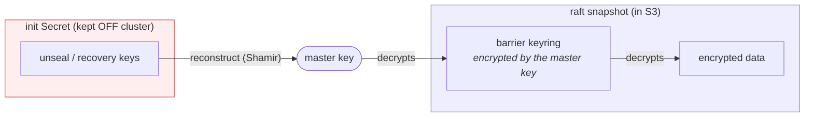
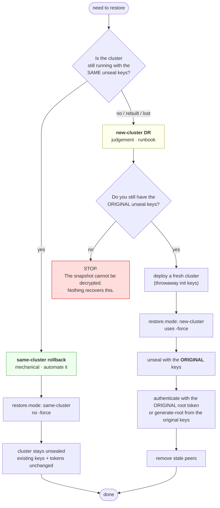
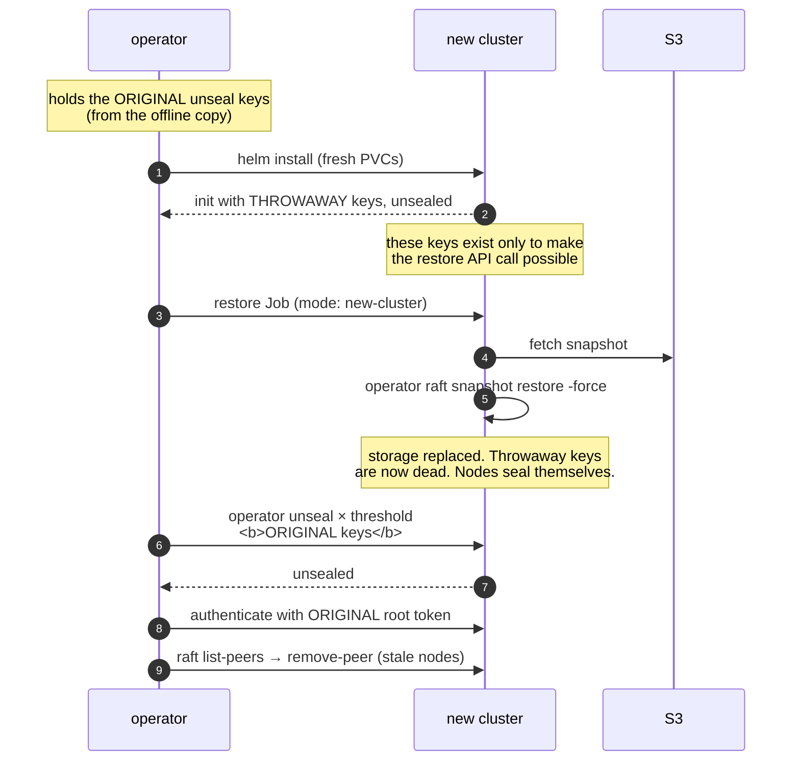

# Restore

## The one thing to understand first

> A raft snapshot contains the **encrypted** store, including the barrier
> keyring. It does **not** contain the unseal or recovery keys.

So a snapshot restored into a cluster whose master key differs from the one that
took it produces data nobody can decrypt — **unless you still hold the original
unseal keys**. This is why `openbao-init-keys` must be copied somewhere durable
and offline before you delete it, and why revoking the root token costs nothing
while losing the unseal keys costs everything.



Backups without the keys are worthless. Test that you have both.

## Should this be in the chart, or a runbook?

**Both — split by which half is mechanical and which needs judgement.**

The mechanical half is worth automating: fetching the right object out of S3,
checking it is actually a valid snapshot before overwriting anything, and
issuing the restore call. Doing that by hand under pressure, from memory, at
2am, is how outages get worse.

The judgement half cannot be automated, and the blocker is structural: a
full disaster-recovery rebuild needs the **original unseal keys**, which by
design do not live in the cluster. No Job can reach them. Choosing *which*
snapshot, confirming the target is the cluster you think it is, and sequencing
the unseal afterwards are all decisions a human has to make.

So the chart ships a restore Job for the mechanical part, disabled by default
and behind a two-value interlock, and this document owns the rest.



## Always dry-run first

Fetches the object, verifies it is a well-formed snapshot (gzip stream, contains
`state.bin`), prints its contents, and writes nothing.

```yaml
restore:
  enabled: true
  snapshot: bao_2026-08-19-2227.snapshot
  confirm:  bao_2026-08-19-2227.snapshot   # must match exactly
  dryRun: true
```

This catches most of what actually goes wrong — wrong prefix, truncated
download, credentials that cannot read the bucket — before anything is
overwritten.

## The interlock

The Job renders only when `restore.confirm` **exactly equals** `restore.snapshot`.
A stale `enabled: true` left in a values file, or a GitOps sync replaying an old
revision, cannot by itself overwrite a live cluster's storage. `backoffLimit: 0`,
so a partially applied restore is never silently retried.

## Same-cluster rollback

Rolling this cluster back to an earlier point. Seal config is unchanged, so no
`-force`, and the cluster stays unsealed throughout.

```sh
helm upgrade openbao openbao/ -n openbao \
  -f values-heathernetes.yaml \
  --set restore.enabled=true \
  --set restore.snapshot=bao_2026-08-19-2227.snapshot \
  --set restore.confirm=bao_2026-08-19-2227.snapshot \
  --set restore.mode=same-cluster \
  --set restore.tokenSecret.name=openbao-restore-token

kubectl -n openbao logs -f job/openbao-restore-<revision>
```

`restore.tokenSecret` is required because the bootstrap revokes the root token.
Mint one first — see **Minting a root token** below.

## Minting a root token (break-glass)

Two things make this harder than the documentation suggests, both verified on
OpenBao 2.6.2:

1. **The endpoints are disabled by default.** Since v2.5.3 the listener
   parameter `disable_unauthed_generate_root_endpoints` defaults to **true**,
   so `/sys/generate-root/*` is not served at all and returns
   `unsupported operation`. This chart sets it to `false` on the **backend**
   listener only (`openbao.server.generateRootEndpoints.backend`), so
   break-glass works from inside the cluster and is never reachable through
   the Ingress/Route. The render refuses `bootstrap.revokeRootToken` without
   it — otherwise revoking the initial token locks you out permanently.

2. **`bao operator generate-root` does not work, in any of its forms.** The CLI
   calls the legacy `/v1/sys/generate-root-token/attempt` path, which the server
   does not register, and returns **403 permission denied**. That covers `-init`,
   `-generate-otp` and `-decode`: even the decode, which is arithmetic on values
   you already hold, calls the status endpoint first. Use the API, and decode the
   token yourself.

```sh
# From a pod in the namespace, against the BACKEND listener.
A=https://openbao-active.openbao.svc:8200/v1/sys/generate-root
CA=/openbao/tls/internal/ca.crt

# Check for (and cancel) any in-flight attempt first — one is exclusive.
curl -s --cacert $CA "$A/attempt"
curl -s --cacert $CA -X DELETE "$A/attempt"      # 204

# Start. Send an empty body and the server generates the one-time pad for you.
curl -s --cacert $CA -X PUT -d '{}' "$A/attempt"
# -> {"nonce":"…","otp":"…","required":3,…}

# Submit `required` unseal keys, once each, with that nonce.
curl -s --cacert $CA -X PUT "$A/update" \
  --data-raw '{"key":"<unseal-key>","nonce":"<nonce>"}'
# the last one returns {"complete":true,"encoded_token":"…"}
```

Decode it yourself: the token is `encoded_token`, base64-decoded, XOR'd byte for
byte with the OTP.

```sh
python3 -c 'import base64,sys
enc,otp=sys.argv[1],sys.argv[2]
raw=base64.b64decode(enc + "="*((4-len(enc)%4)%4))
print(bytes(a^b for a,b in zip(raw,otp.encode())).decode())' <encoded_token> <otp>
```

Then store it and point the restore at it:

```sh
kubectl -n openbao create secret generic openbao-restore-token --from-literal=token=<new-root>
```

**Revoke it again when you are done** (`bao token revoke -self`). It is a root
token; it does not expire.

Afterwards, set `restore.enabled=false` and upgrade again, so the next sync does
not replay it.

## New-cluster disaster recovery



Points that catch people out:

1. **The target must be initialised and unsealed before you restore.** A restore
   is an authenticated API call. Even though the whole point is to replace the
   contents, you need a working cluster to talk to first.
2. **`-force` is required**, because the snapshot's seal configuration does not
   match the fresh cluster's.
3. **The keys from the fresh init stop working the moment the restore lands.**
   Unseal with the original keys.
4. **`list-peers` will show nodes from the old cluster.** Remove them with
   `remove-peer`, and note that a removed node cannot rejoin without full
   reinitialisation.
5. Restore onto **one** node first so it becomes leader, then let the others
   join.

## Testing your backups

An untested backup is a hypothesis. Quarterly, and after any change to storage
or the snapshot agent:

```sh
# 1. restore into a throwaway namespace with values-dev.yaml
# 2. mode: new-cluster, using a copy of the real snapshot
# 3. unseal with the real unseal keys  <-- this is the step that proves it
# 4. bao secrets list; spot-check a known path
# 5. delete the namespace
```

Step 3 is the whole point. A restore that "succeeds" and then cannot be unsealed
is the failure mode this document exists to prevent, and it only shows up if you
actually try it.

## What the chart does not do

- Decide which snapshot to use.
- Hold your unseal keys. Deliberately.
- Restore automatically on failure. A raft cluster that has lost quorum but kept
  its data usually wants `remove-peer`, not a restore; reaching for a restore
  first can turn a recoverable incident into data loss.
