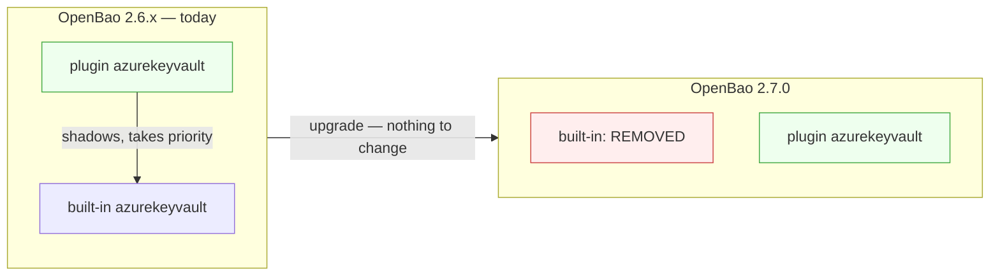
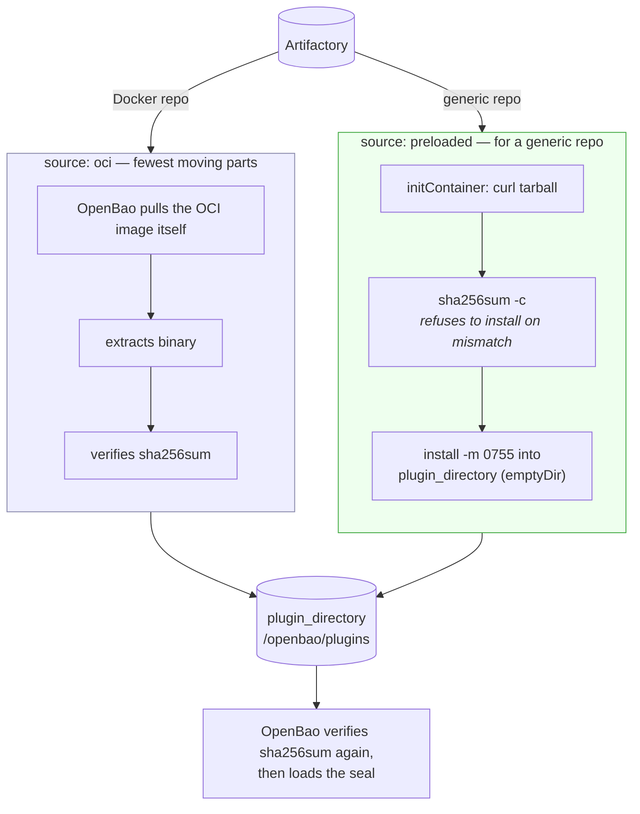
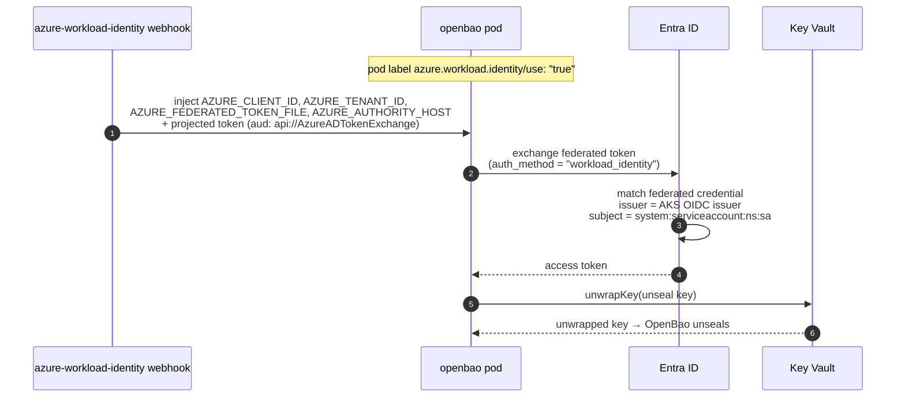
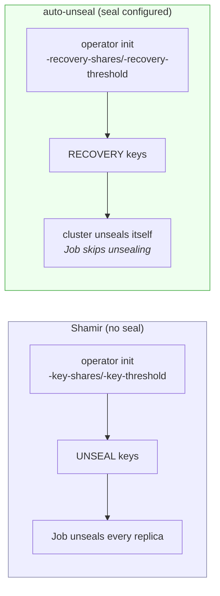

# Auto-unseal

Two environments, two mechanisms — and only one of them needs a plugin.

| Environment | Seal | Plugin needed? | Overlay |
|---|---|---|---|
| Azure | `azurekeyvault` | **yes**, from v2.7.0 | `values-azure.yaml` |
| Other | `transit` (another OpenBao) | no — stays built-in | `values-transit.yaml` |

## What changes in v2.7.0

The built-in `alicloudkms`, `awskms`, **`azurekeyvault`**, `gcpckms`, `ocikms`
and `pkcs11` seals are **removed from the OpenBao binary in v2.7.0** and remain
available as external plugins only. `transit` is **not** on that list.

A plugin **shadows a built-in of the same name and takes priority**. So register
the plugin now, while still on 2.6.x, and the 2.7.0 upgrade becomes a no-op
instead of a flag day. That is the migration path this chart takes.



## Getting the plugin into the pod

Two delivery paths, both airgap-capable. `seal.plugin.source` picks one.



**`sha256sum` is mandatory either way** — OpenBao verifies the binary against it
on load. That is precisely what makes pulling from a mirror or Artifactory safe,
and why the chart refuses to render without it.

Use `preloaded` when Artifactory serves the release tarball from a *generic*
repo rather than as an OCI image, or when the OpenBao pod itself is not allowed
egress to a registry. Use `oci` otherwise.

### The two binary names

Same binary, same bytes, same checksum — packaged under different names:

| Source | Name |
|---|---|
| OCI image `ghcr.io/openbao/openbao-plugin-kms-azure:v0.1.0` | `openbao-plugin-kms-azure` |
| Release tarball `openbao-plugin-kms-azure_linux_amd64_v1.tar.gz` | `openbao-plugin-kms-azure_linux_amd64_v1` |

### The image reference is split in two

`image` takes the repository **without a tag**; the tag goes in `version`.
OpenBao assembles the reference itself as `image` + `:` + `version`, so leaving
the tag on `image` yields a second colon and the server refuses to start:

```
image and version do not form a valid image reference
```

```hcl
plugin "kms" "azurekeyvault" {
  image       = "artifactory.example.com/openbao/openbao-plugin-kms-azure"
  version     = "v0.1.0"
  binary_name = "openbao-plugin-kms-azure"
  sha256sum   = "e46a6d13…"
}
```

A registry **port** — `artifactory.example.com:5000/openbao/…` — is fine; only a
trailing `:tag` is not. The chart checks the last path segment only, and
`version` is required in both delivery modes, not just `oci`.

### `plugin_auto_download` defaults to false

So does `plugin_auto_register`. With `source: oci` the plugin directory is an
empty `emptyDir` and nothing else populates it, so without
`seal.autoDownload: true` the server never contacts the registry and the seal
fails as "plugin not found" — the config file looks complete either way. The
chart fails the render on that combination.

`autoRegister` is a separate matter: a `kms` plugin is usable at startup without
appearing in the plugin catalog, so it does not need registering. It is only
what makes `plugin.args` and `plugin.env` take effect, and the chart fails the
render if either is set without it.

`downloadBehavior` renders `plugin_download_behavior`, whose accepted values are
`fail` and `warn`.

### A registry behind a private CA

The **server process** performs the pull, and the plugin stanza has no CA option
of its own, so the registry's CA has to be in OpenBao's trust store. Missing, it
surfaces as `x509: certificate signed by unknown authority` from the plugin
download rather than from the seal.

`seal.plugin.registryCA` declares it. Three things have to agree, and because
Helm cannot template subchart values none of them follows from the others — the
chart fails the render if any is missing:

```yaml
openbao:
  server:
    seal:
      plugin:
        registryCA:
          configMap: artifactory-ca-bundle
          key: ca-bundle.crt
          mountPath: /openbao/tls/registry

    volumes:
      - name: registry-ca
        configMap: { name: artifactory-ca-bundle }
    volumeMounts:
      - { name: registry-ca, mountPath: /openbao/tls/registry, readOnly: true }

    extraEnvironmentVars:
      SSL_CERT_DIR: /openbao/tls/internal:/openbao/tls/registry
```

Give it **its own directory**: `SSL_CERT_DIR` reads a directory whole, and the
backend CA's mount is a Secret that cannot be merged with a ConfigMap.

> **`SSL_CERT_DIR` replaces, it does not extend.** Go reads only the directories
> named there — the default `/etc/ssl/certs` and friends drop out — so the list
> is colon-separated and every directory you need must appear in it. Losing
> `/openbao/tls/internal` while adding the registry breaks the http audit
> device, which takes no CA option either, and a failing audit device stops
> OpenBao serving requests. The chart checks for that entry too.
>
> Public roots are unaffected: they come from a default bundle **file**
> (`/etc/pki/ca-trust/extracted/pem/tls-ca-bundle.pem` on the UBI image) that
> `SSL_CERT_DIR` does not touch. `SSL_CERT_FILE` *would* replace it — never set
> that one.

A ConfigMap volume presents each key as a symlink into `..data/`. Go follows
those (it only skips symlinks pointing within the same directory), so the bundle
is read normally.

Registry **credentials** are a separate matter: OpenBao reads them from
`~/.docker/config.json`, `$DOCKER_CONFIG/config.json`, `$REGISTRY_AUTH_FILE` or
`$XDG_RUNTIME_DIR/containers/auth.json` — an imagePullSecret does not reach it,
because the pull is not Kubernetes'.

The published `checksums-kms-azure.txt` line refers to the **tarball** name.
Verified by extracting both and comparing hashes — identical
(`e46a6d13…`). The chart models this as two values: `binaryName` (OCI /
installed name) and `archiveBinary` (inside the tarball, used for the checksum
check). Mixing them up surfaces as "plugin not found" or a checksum mismatch,
neither of which points at the naming.

Mirror both if you want both paths available:

```sh
skopeo copy --all \
  docker://ghcr.io/openbao/openbao-plugin-kms-azure:v0.1.0 \
  docker://artifactory.example.com/openbao/openbao-plugin-kms-azure:v0.1.0

curl -fLO https://github.com/openbao/openbao-plugins/releases/download/\
kms-azure-v0.1.0/openbao-plugin-kms-azure_linux_amd64_v1.tar.gz
```

## Azure Key Vault with Workload Identity

Federated OIDC — no client secret anywhere in the cluster.



`auth_method = "workload_identity"` selects `WorkloadIdentityCredential`
explicitly. `default` would also find it, but only after walking a credential
chain, and it fails less clearly when misconfigured.

Leave `tenantId` and `clientId` **empty** — the webhook injects them, and values
in the config file take precedence over what it injected.

### Prerequisites outside this chart

1. Key Vault + key, with the managed identity granted **Key Vault Crypto User**
   (`wrapKey`, `unwrapKey`, `get`).
2. A **federated credential** on that identity:
   `issuer` = the AKS cluster's OIDC issuer URL,
   `subject` = `system:serviceaccount:<namespace>:<serviceaccount>`,
   `audience` = `api://AzureADTokenExchange`.
3. The **azure-workload-identity webhook** installed. It only mutates pods
   carrying the `azure.workload.identity/use: "true"` label — the chart fails
   the render if that label or the SA's `client-id` annotation is missing,
   because otherwise the seal fails at startup with an opaque credential error.

## Transit

No plugin needed. The token comes from a Secret via
`extraSecretEnvironmentVars`, never from the config file — that is a ConfigMap.

On the unsealer:

```sh
bao secrets enable transit
bao write -f transit/keys/openbao-unseal
bao policy write openbao-unseal - <<'POLICY'
path "transit/encrypt/openbao-unseal" { capabilities = ["update"] }
path "transit/decrypt/openbao-unseal" { capabilities = ["update"] }
POLICY
```

> **Circularity warning.** The unsealer must not depend on this cluster for
> anything, or a simultaneous restart deadlocks both. Keep it in a separate
> failure domain, and keep it Shamir- or KMS-sealed itself.

Its CA is its own trust domain — mount it separately, do **not** reuse this
cluster's backend CA.

## What auto-unseal changes about bootstrap

`bootstrap.init.autoUnseal: true` is **mandatory** with any seal, and the chart
fails the render if the two disagree in either direction.



**Recovery keys do not unseal anything.** They authorise recovery operations —
root generation, `rekey`. Note those endpoints are disabled by default since
v2.5.3; see [RESTORE.md](RESTORE.md#minting-a-root-token-break-glass). Store them as carefully as unseal keys, and note the
harder truth: with auto-unseal, **losing the KMS key is unrecoverable no matter
what you kept**. Back up the Key Vault key, and see
[RESTORE.md](RESTORE.md) — a snapshot is still worthless without the means to
decrypt it.

## Verification status

Rendered and validated, **not deployed** — the homelab cluster has neither Azure
nor a second OpenBao. What was checked directly:

- both overlays render; the `seal`, `plugin`, `plugin_directory` stanzas emit
  correctly, and `plugin_directory` is omitted when no plugin is registered
- the split `image`/`version` reference, `plugin_auto_download` and
  `plugin_auto_register` were corrected against the upstream declarative-plugin
  docs after a live `image and version do not form a valid image reference`
- the registry-CA wiring renders, and all four ways of getting it half-right
  fail the render; the trust mechanism is read from Go's `crypto/x509`, not
  tested against a private registry
- the plugin OCI image and release tarball were both fetched and their binaries
  hashed — identical bytes, and the published checksum matches
- the fetch script's download → `sha256sum -c` → `install` logic was executed
  against the real artifact; a tampered binary is correctly refused
- 19 negative tests against the validation rules, all caught

Not verified without Azure: the federated token exchange and an actual
wrap/unwrap against Key Vault.
